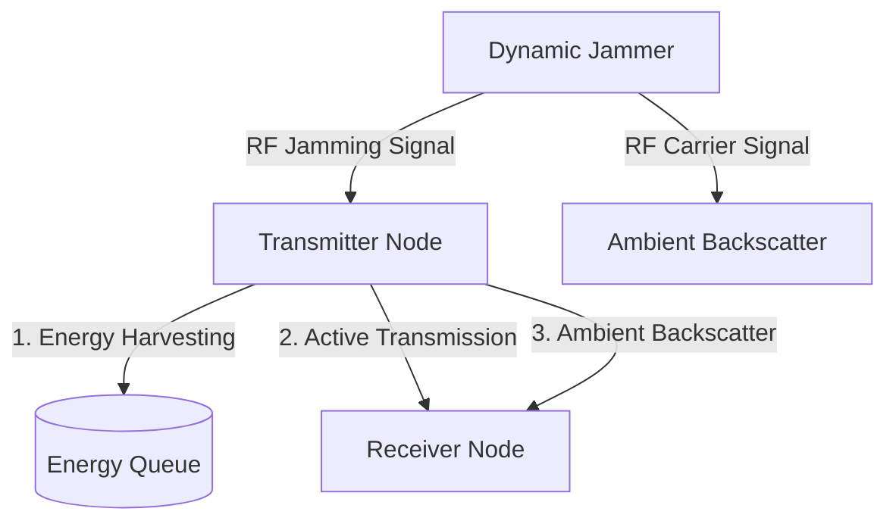

# Deep Reinforcement Learning for Wireless Anti-Jamming

[](https://www.python.org/)
[](https://github.com/tensorflow/tensorflow)
[](https://opensource.org/licenses/MIT)

This repository provides a Python implementation of a deep reinforcement learning (DRL) framework for wireless communications anti-jamming, built based on **Chapter 4** of the book:
> **"Deep Reinforcement Learning for Wireless Communications and Networking"**

The objective of this project is to enable a wireless transmitter to adaptively learn optimal transmission strategies in the presence of an unpredictable and dynamic jammer without any prior knowledge of the jammer's patterns.

---

## 📖 System Overview & Problem Statement

In a wireless network, communication between a transmitter and a receiver is highly vulnerable to jamming attacks. A jammer continuously or dynamically emits radio signals to degrade the Signal-to-Interference-plus-Noise Ratio (SINR) at the receiver. 

To overcome this vulnerability, the transmitter is equipped with two key hardware features:
1. **Energy Harvesting (EH):** The transmitter can harvest energy directly from the radio frequency (RF) signals emitted by the jammer to recharge its battery.
2. **Ambient Backscatter (AB):** The transmitter can utilize the jammer's signal as a carrier, passively reflecting it to transmit data to the receiver without consuming its own active transmission energy.



---

## 🧮 MDP Formulation (Markov Decision Process)

The anti-jamming communication process is formulated as a Markov Decision Process (MDP) to allow agents to learn optimal policies through interaction with the simulated environment:

### 1. State Space ($S$)
The state is a 3-dimensional tuple $S = (J, Q_d, Q_e)$ where:
*   **Jammer State ($J \in \{0, 1\}$):** $0$ represents the Jammer is idle, and $1$ represents the Jammer is active (jamming).
*   **Data Queue ($Q_d \in \{0, \dots, D_{\max}\}$):** The number of data packets waiting in the buffer (default capacity $D_{\max} = 10$).
*   **Energy Queue ($Q_e \in \{0, \dots, E_{\max}\}$):** The units of harvested energy stored in the battery (default capacity $E_{\max} = 10$).

### 2. Action Space ($A$)
At each time step, the agent chooses from up to 7 possible actions ($A \in \{0, 1, 2, 3, 4, 5, 6\}$):
*   **Action 0 (Idle):** Transmitter waits (zero throughput, zero energy cost).
*   **Action 1 (Active Transmission):** Transmits actively with maximum rate $d_t$ (only allowed when Jammer is idle, $J=0$).
*   **Action 2 (Energy Harvesting - EH):** Harvests RF energy from the jamming signal to charge the battery (only when Jammer is active, $J=1$).
*   **Action 3 (Ambient Backscatter - AB):** Passively reflects the jamming signal to transmit data at a low backscatter rate (only when Jammer is active, $J=1$).
*   **Actions 4, 5, 6 (Rate-Adaptive Active Transmission):** Active data transmission under jamming with adaptive transmission rates (only when Jammer is active, $J=1$).

### 3. Reward Function ($R$)
The reward is defined as the **network throughput** (number of data packets successfully received by the receiver) during the step, encouraging the agent to maximize long-term average throughput.

---

## 📂 Repository Architecture

The repository contains the following main files:

*   [`parameters.py`](file:///k:/21020771/DRL/anti_jamming/parameters.py): Defines the simulation environment parameters (e.g., buffer capacities, data arrival rates, harvesting rates) and RL/DRL training hyperparameters (e.g., learning rates, discount factors, batch size, memory size, target network update frequency).
*   [`environment.py`](file:///k:/21020771/DRL/anti_jamming/environment.py): The simulation environment. Models state transitions, computes rewards, simulates Poisson data packet arrivals, and tracks energy queue and jammer states.
*   [`q_learnning.py`](file:///k:/21020771/DRL/anti_jamming/q_learnning.py): Implements the traditional **Tabular Q-Learning** agent using an $\epsilon$-greedy exploration strategy.
*   [`deep_q_learning.py`](file:///k:/21020771/DRL/anti_jamming/deep_q_learning.py): Implements the **Deep Q-Learning (DQN / Dueling DQN)** agent. It leverages a Deep Neural Network (DNN) with Experience Replay and a Target Network to stabilize and accelerate training.

---

## ⚙️ Installation and System Requirements

The code is optimized to run on **Anaconda** with Python 3.9 and TensorFlow 2.9.1. 

### Step 1: Install Anaconda
If you do not have Anaconda installed, download and install it from [Anaconda's Official Website](https://www.anaconda.com/).

### Step 2: Create a Dedicated Virtual Environment
Open your Terminal (macOS/Linux) or Anaconda Prompt (Windows) and run:
```bash
conda create -n tf-drl-book tensorflow=2.9.1 python=3.9 keras=2.9 numpy=1.22.4 scipy -y
```
*(Note: If you have a CUDA-compatible GPU, you can install GPU-supported tensorflow versions to accelerate training)*

### Step 3: Activate the Environment
```bash
conda activate tf-drl-book
```

---

## 🚀 Usage Guide

You can run the training loops directly from the command line. The simulation is configured to run for **1,000,000 steps** by default. Training progress and average throughput (average rewards) are printed to the console every **1,000 steps**.

### Train the Tabular Q-Learning Agent:
```bash
python q_learnning.py
```

### Train the Deep Q-Learning (DQN / Dueling DQN) Agent:
```bash
python deep_q_learning.py
```

---

## 📊 Key Experimental Findings

Simulations show that deep reinforcement learning provides significant advantages in solving wireless anti-jamming problems:

*   **Convergence Rate:** The Dueling Deep Q-Network (DQN) converges much faster and learns a more stable anti-jamming policy compared to the traditional tabular Q-Learning agent, which suffers from slow updates in larger state spaces.
*   **Optimal Deep Architecture:** 
    *   **Activation Functions:** Using `tanh` in the hidden layers provides more stable policy learning than standard `relu` for this bounded continuous state representation.
    *   **Optimizers:** The `Adam` optimizer (learning rate $\alpha \in [10^{-4}, 10^{-3}]$) significantly outperforms stochastic gradient descent (`SGD`) in handling dynamic gradient flows from environment transitions.

---

## 📄 License
This project is licensed under the MIT License - see the [LICENSE](LICENSE) file for details.
